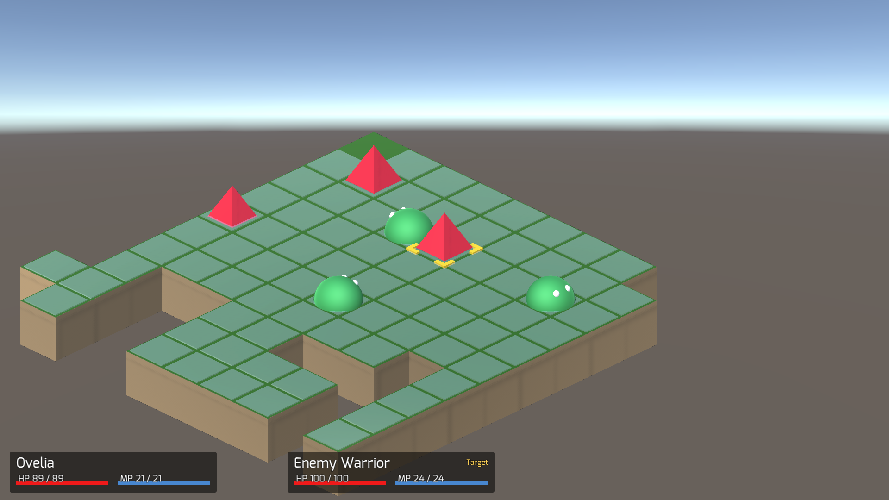
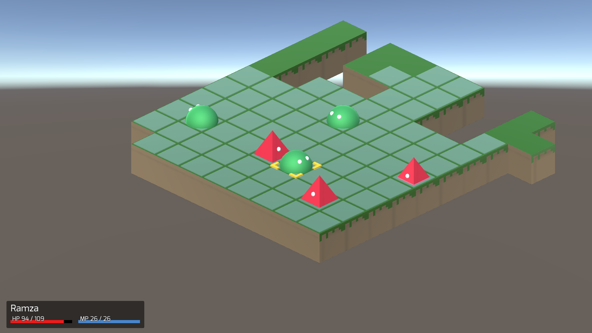

# Tactical RPG prototype

This project is a really barebone tactical RPG i built to learn how to use Unity and to get back to C#.

Special thanks to [Jon](http://theliquidfire.com/about/) for his super useful series of unity tutorial (http://theliquidfire.com/2015/05/04/tactics-rpg-series-intro/)

## How to use

- Open the project with Unity (tested on 2021.3.3f1 LTS)
- Run `Pre Production/Parse Enemies` and `Pre Production/Parse Jobs` tools to generate some test data
- Start the game

Note: you might run in some issues (missing meshes) if you don't have Blender (3.1) installed on your machine, but the game should still run.
